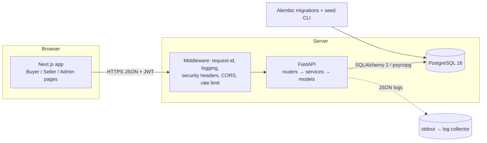
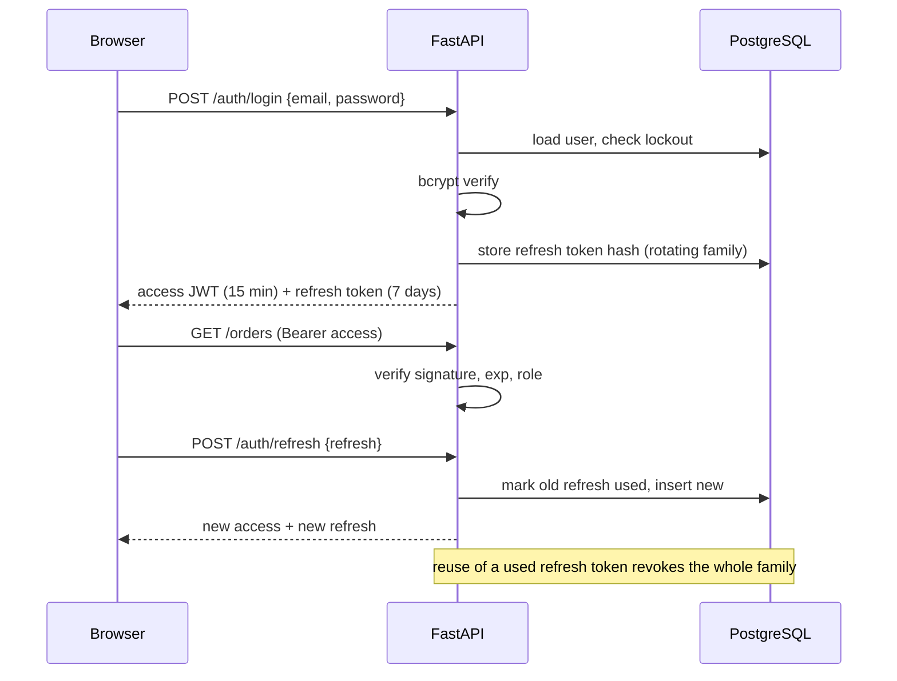
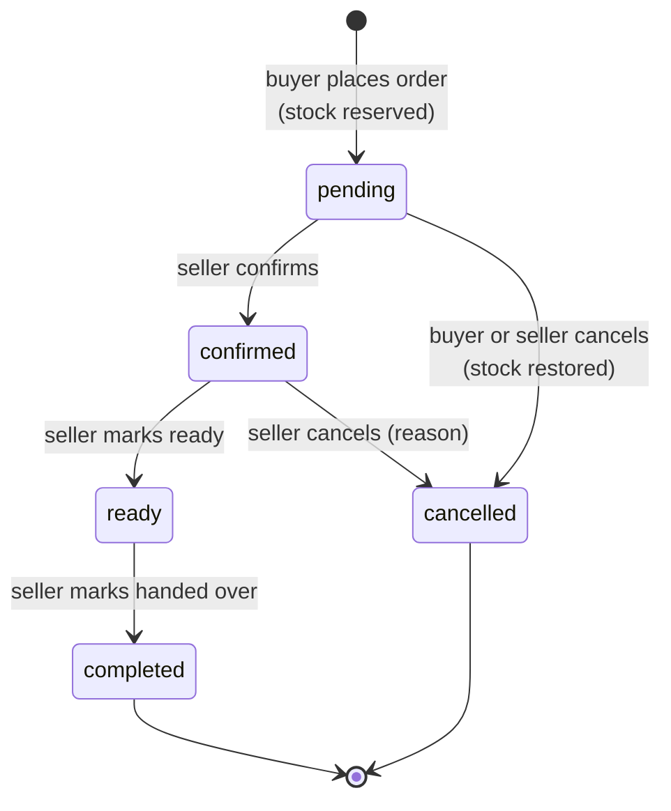
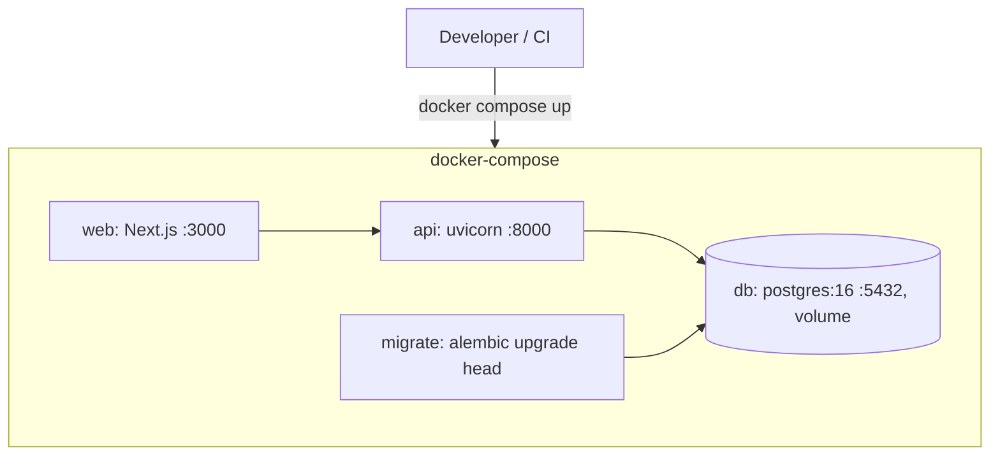

# 2. Architecture

## 2.1 Style
A classic three-tier web application: **Next.js (TypeScript)** for the UI, **FastAPI** for a stateless JSON API, **PostgreSQL** for data. The API is the only component that touches the database. The browser talks to the API with `Authorization: Bearer <access token>`.

## 2.2 Backend layers
| Layer | Responsibility | Must not |
|---|---|---|
| `routers/` | HTTP: parse, call service, return schema, declare required role | contain business rules or SQL |
| `schemas/` | Pydantic v2 request/response models and validation | touch the DB |
| `services/` | Business rules, transactions, audit events, authorisation of *objects* | know about HTTP |
| `models/` | SQLAlchemy 2 ORM models, constraints, indexes | contain logic |
| `core/` | settings, security (hashing, JWT), logging, errors, pagination, deps | import routers |

**Authorisation is two-step.** (1) A router dependency `require_role(...)` checks the *role*. (2) The service checks *ownership* (e.g. `product.seller_id == current_user.seller_profile.id`). Both are covered by tests, because a missing ownership check is the most common marketplace flaw.

## 2.3 Authentication flow

The frontend keeps the access token in memory and the refresh token in an **httpOnly, SameSite=Lax, Secure cookie** set by a Next.js route handler (BFF pattern), so JavaScript cannot read it (XSS-resistant).

## 2.4 Order flow (simulated payment)

`payment_preference` (`cash` | `mobile_money`) and `mobile_money_provider` are **labels the seller sees**; `payment_status` is the constant `not_processed`. No amount is ever sent anywhere.

## 2.5 Cross-cutting concerns
- **Errors**: every failure returns `{"error": {"code", "message", "details?", "request_id"}}` with a correct status (400/401/403/404/409/422/429/500). Unhandled exceptions are logged with a stack trace and returned as a generic 500.
- **Logging**: JSON lines (`ts, level, request_id, method, path, status, ms, user_id`); passwords, tokens and Authorization headers are never logged.
- **Pagination**: `?page=1&page_size=20` → `{items, page, page_size, total, pages}`; whitelisted `sort` fields.
- **Audit**: `created_at`/`updated_at` (timezone-aware UTC) on every table; `audit_log` rows for login success/failure, role-relevant changes, seller approval, order status changes and deletions.
- **Config**: 12-factor, environment variables only (`.env.example` documents them; `.env` is git-ignored).

## 2.6 Deployment view

Production adds a TLS-terminating reverse proxy (Caddy/Nginx), managed PostgreSQL backups and secrets from the platform's secret store.

## 2.7 Key decisions (ADR summary)
| Decision | Why | Alternative rejected |
|---|---|---|
| JWT access + rotating refresh in httpOnly cookie | Stateless API, XSS-safe refresh token | Long-lived JWT in localStorage |
| SQLAlchemy 2 + Alembic | Typed models, reviewable migrations | Raw SQL / `create_all` |
| Single-seller orders | Simple fulfilment and permissions | Multi-vendor cart |
| Soft delete for products | Order history keeps referencing them | Hard delete |
| Price/name snapshot in `order_items` | Later price edits must not change past orders | Join to live product |
| Numeric money, integer stock | No float rounding | Float prices |
