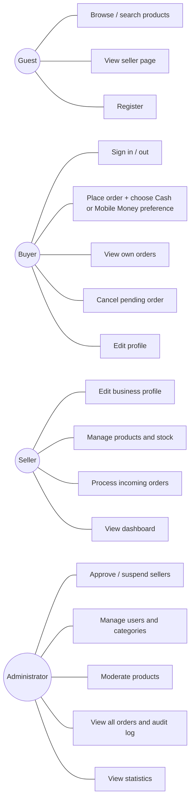

# 3. Use cases

## UC-05 Place an order (detailed)
- **Actor**: Buyer. **Pre**: signed in, cart has items from one approved seller.
- **Main flow**: 1 buyer reviews cart → 2 chooses *Cash* or *Mobile Money* (and optionally a provider: M-Paisa, HesabPay, Other) → 3 adds a delivery/pick-up note → 4 submits → 5 server validates items, prices, stock and seller status → 6 creates the order and items, reserves stock in one transaction → 7 returns the order (`pending`, `payment_status = not_processed`) → 8 audit row written.
- **Alternate**: stock insufficient → 409 `insufficient_stock` naming the product; seller suspended → 409 `seller_unavailable`; items from two sellers → 422.
- **Post**: seller sees the order with the buyer's preference; nothing is charged.

## UC-11 Process incoming order
Seller opens *Incoming orders* → filters by status → opens an order (sees items, buyer contact, payment preference) → confirms / marks ready / completes / cancels with reason. Illegal transitions return 409 `invalid_transition`. Each change writes `audit_log`.

## UC-13 Approve seller
Admin opens *Sellers → Pending* → reviews business profile → approves (seller becomes visible and can list products) or rejects with a note. Suspended sellers disappear from public lists; existing orders remain visible to their parties.

## Role × capability matrix
| Capability | Guest | Buyer | Seller | Admin |
|---|:-:|:-:|:-:|:-:|
| Browse approved sellers / active products | ✔ | ✔ | ✔ | ✔ |
| Register / login | ✔ | – | – | – |
| Edit own profile | – | ✔ | ✔ | ✔ |
| Place / cancel own pending order | – | ✔ | – | – |
| See own orders | – | ✔ | ✔ (received) | ✔ (all, read-only) |
| CRUD own products | – | – | ✔ (if approved) | hide only |
| Change order status | – | cancel | ✔ (own) | – |
| Approve / suspend sellers | – | – | – | ✔ |
| Manage users / categories | – | – | – | ✔ |
| Audit log, statistics | – | – | own dashboard | ✔ |
