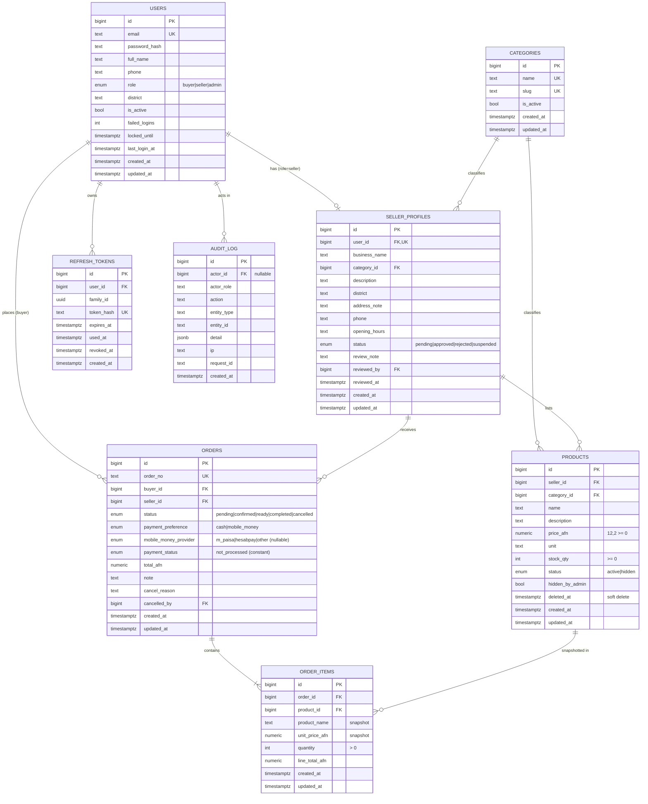

# 4. ER diagram

## Integrity rules
- `orders.payment_status` has `CHECK (payment_status = 'not_processed')` — the database itself refuses anything that would imply a real payment.
- `orders.mobile_money_provider` must be `NULL` when `payment_preference = 'cash'` (CHECK).
- A buyer cannot be the seller of their own order (service rule + test).
- `order_items.line_total_afn = unit_price_afn * quantity` (CHECK). `orders.total_afn` equals the sum of its lines (service rule + integration test).
- Products referenced by orders are soft-deleted (`deleted_at`), never removed.
